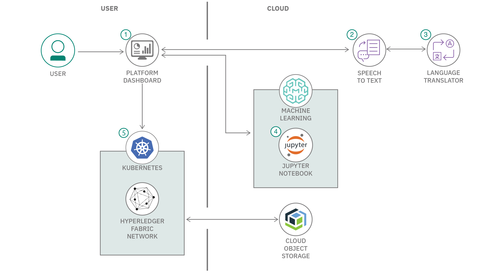
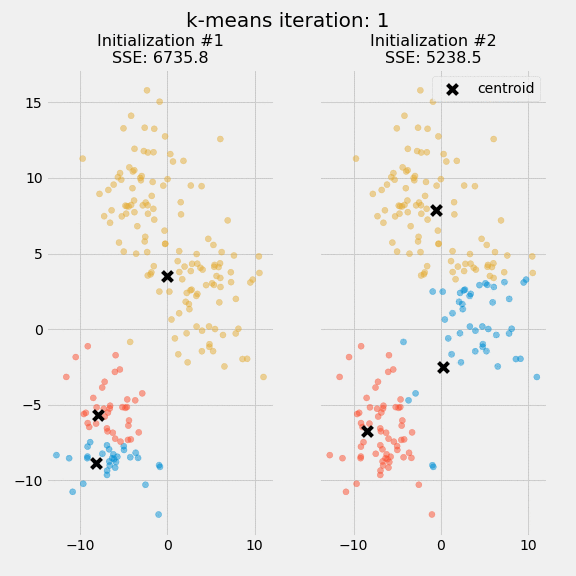
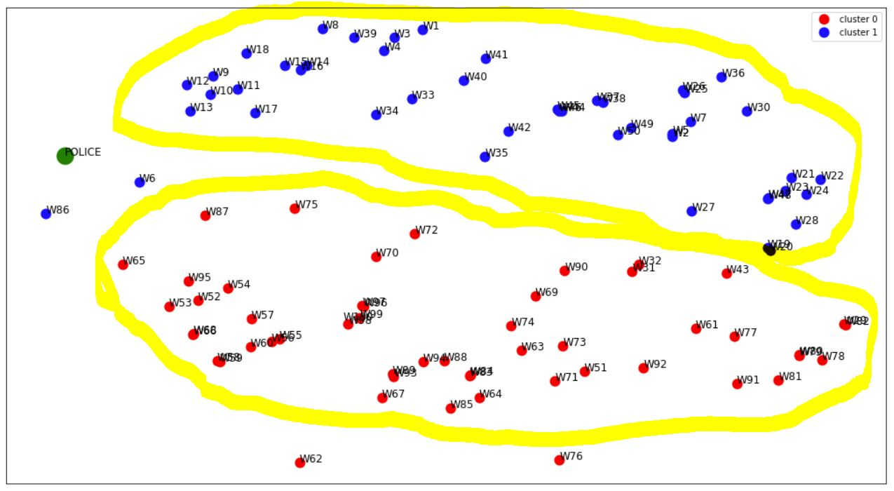

# Incident Accuracy Reporting System (IARS)


This solution starter was created by technologists from IBM.

## Authors


* [Abiola Asojo](https://www.linkedin.com/in/abiola-asojo/)

* [Kalonji Bankole](https://developer.ibm.com/profiles/kkbankol/)

* [Danny Belitz](https://www.linkedin.com/in/dannybelitz/)

* [Laura Bennett](https://developer.ibm.com/profiles/lbenn/)

* [Brandon Kravitz](https://www.linkedin.com/in/brandon-k-06570945/)

* [Monica Martinez](https://www.linkedin.com/in/monica-martinez-22b4662/)

* [Tunde Olokodana](https://www.linkedin.com/in/tunde-olokodana-5245902b/)

* [Osai Osaigbovo](https://www.linkedin.com/in/osai-osaigbovo-0153213/)

* [Lucia Ramos](https://www.linkedin.com/in/silvia-lucia-ramos-quispe-b96307ba/)

* [Debra Scott](https://www.linkedin.com/in/debra-scott-aa358410/)

* [Shalisha Witherspoon](https://www.linkedin.com/in/shalisha-witherspoon-792a65b8/)

* [Shonda Witherspoon](https://developer.ibm.com/profiles/shonda.adena.witherspoon/)

* Special Thanks [Cedric Cook](https://www.linkedin.com/in/cedriccook/), [Calvin Lawrence](https://www.linkedin.com/in/lawrencecalvin/), [Joseph Kozhaya](https://www.linkedin.com/in/joe-kozhaya-b574b533/)


## Contents
   1. [Overview](#1-overview)
   2. [The idea](#2-the-idea)
   3. [How it works](#3-how-it-works)
   4. [Architecture](#4-architecture)
   5. [Documents](#5-documents)
   6. [Technology](#6-technology)
   7. [Getting started](#7-getting-started)
   8. [IARS-Recommendations for Enhancements of Capabilities](#8-iars-recommendations-for-enhancements-of-capabilities)
   9. [Resources](#9-resources)
   10. [License](#10-license)

## 1. Overview

### What is the problem?
We currently live in an environment where we are finding more instances where law enforcement agencies are racially biased and are conducting unlawful practices and policies (e.g. "dirty policing"). The practices and policies are shaping the methodology by which data is created which increases inaccurate, skewed or systemically biased information.  The lack of transparent and accurate data available to assess police behavioral infractions means, police reports can be falsified and covered up.

### How can technology help?

From traffic stops and arrests to sentencing and parole decisions, using technology leads to better analysis of real-world data, provides insights, and makes recommendations that will drive racial equality and reform across criminal justice and public safety.  Policing agencies should consider piloting technology to improve operational efficiencies and outcomes. Given that current times have led to decreased number of resources and increased public scrutiny of law enforcement activity, technology is a solution that could address these issues.  Internal affairs and civilians (such as witnesses) can both contribute to incident reports, creating a record with all accounts of the incident.

The intersection of IBM Watson APIs and Hyperledger Blockchain technology enables users to ensure consistency of information and a secure immutable permissioned ledger of documents. As more agencies are trying to show transparency and ensure that their officers are all operating above board; using AI and Blockchain can help to facilitate those objectives.


## 2. The Idea

The lack of faith in our policing system has citizens looking for justice and a need to regain faith in those who are paid to protect us.

With the Incident Accuracy Reporting System, law enforcement can once again build that faith by creating a platform where all those involved or witnesses can provide relevant documentation about an incident.

Specifically, the platform is a content management application for capturing statements, videos, and audio feeds from first-hand individuals relating to police incident reports.  It provides a(n):

* interface for first-hand individuals to input information or data related to incident report
* automated/manual flagging of inconsistencies and inaccuracies contained in initial incident reports based on collected data
* cross reference report data with officer history on misconduct
* mechanism for disputing claims in incident reports
* backend to a Blockchain instance that contains a hash to the actual document stored in Object Store

## 3. How It Works

**Note** This project is currently scoped for the United States.  We fully expect that international parties will eventually contribute to extend the scope to support law enforcement agencies globally.

* If a 911 call is made, the event’s address, date, and time is logged as an incident.

* An incident may or may not be given a case number
* Incidents reported via app can be linked by provided case number (if known), or by correlating the submitted metadata(location, date, and time)  with a logged incident from the police department
* If an event has not yet been logged as an incident by the police department (ex: occurring live at a protest), reported incidents submitted through app can be tagged as pending until a matching police incident can be linked once filed.

## 4. Architecture

Content Management application backed by artificial intelligence and a distributed ledger that holds immutable data in a secure and encrypted way that insures documents can never be altered

### The Component Model



#### Flow
1. User uploads documents to the platform
2. If documents contain video or audio, run the document through Watson Speech to Text and create transcript
3. If transcript is in non-English language; translate to English using Language Translator
4. Validate document with other case documents using SCIkit learn
5. Store documents in Cloud Object Store linked to a hash stored in the Hyperledger blockchain

### The Operational Model


## 5. Documents

* [Design Document](./documents/design-doc.md)

* [Prototyping Wireframe Document](./documents/wireframe-doc.md)


## 6. Technology

### IBM Technology

* [Watson Speech To Text](https://www.ibm.com/cloud/watson-speech-to-text):  This is an IBM Cloud service that converts human voice into written text. This application uses it to create written transcripts from audio recordings loaded by witnesses and victims.

* [Watson Language Translator](https://cloud.ibm.com/apidocs/language-translator): Translates text from one language to another

* [IBM Watson Studio](https://www.ibm.com/cloud/watson-studio): Build, run and manage AI models. 

* [IBM Cloud Object Storage](https://cloud.ibm.com/docs/cloud-object-storage?topic=cloud-object-storage-getting-started-cloud-object-storage): (lite tier) stores encrypted and dispersed data. Documents(incident reports, videos, audios) are saved on IBM Cloud Object Storage.


### Open Source Technology

* [Vue.js](https://vuejs.org/): An open-source model-view-viewmodel front end JavaScript framework for building user interfaces and single-page applications

* [Docker](https://www.docker.com/): Docker is a set of platform as a service products that use OS-level virtualization to deliver software in packages called containers. Containers are isolated from one another and bundle their own software, libraries and configuration files; they can communicate with each other through well-defined channels

* [FFmpeg](https://ffmpeg.org/): an open source, cross-platform solution to record, convert and stream audio and videos. This was used to transcribe the audio portion of a video.

* [Blockchain](https://hyperledger-fabric.readthedocs.io/en/release-1.4/): Based on the open-soure enterprise grade permissioned distributed ledger; Hyperledger Fabric. The blockchain network is an immutable transaction ledger. This was used to ensure that the submitted reports and information from victims and witnesses are secure. Each stored document has a hash tag that is stored in the Blockchain. You can run the application without it.

* [scikit-learn](https://scikit-learn.org/stable/): Scikit-learn open source machine learning library for the Python programming language. It features various classification, regression and clustering algorithms including support vector machines, random forests, gradient boosting, k-means and DBSCAN, and is designed to interoperate with the Python numerical and scientific libraries NumPy and SciPy.


### Technology Concepts

* Machine Learning - The application uses unsupervised k-Means Clustering. Features were first extracted from the various statements submitted by witnesses using the term-frequency inverse-document-frequency (TFIDF) technique before applying the clustering algorithm for consistency check.

### k-Means Clustering

#### Introduction
k-Means clustering is an unsupervised machine learning algorithm which does not require a labeled dataset with an input-output mapping. It is preferred for this project due to its efficiency in documents analysis by grouping them into clustered partitions based on the content of the documents. It also eliminates the cost of labeling a dataset and saves the time for doing so. Each document represents a datapoint. Specifically in this case, each witness' statement is a document which forms a datapoint in a cluster.

#### Feature Extraction
There are different feature extraction methods that can be used in text analysis problems such as bag of words, binary representation and term frequency - inverse document frequency (TFIDF) etc. TFIDF is selected for this project because of its efficiency in finding similarity groups in a set of documents. Term frequency (TF) is the fractional measure of the number of times a word or a term appears in a document while inverse document frequency (IDF) measures how imortant a term is, since frequency does not necessarily mean importance. The final output from the feature extraction is presented to the kmeans algorithm in vectorized form. Prior to the feature extraction, stop words which are regarded as noise are removed and stemming is used to reduce the words to their root words.

#### Clustering Process
The desired number of clusters is first specified. In this project, the number of clusters with an optimal clustering performance is automatically generated using the elbow method. A centroid is then randomly initialized for each cluster. A centroid refers to a positional mean value. Datapoints are attached to the clusters based on their closeness to the centroids. After each iteration, a new centroid is calculated for each cluster by finding the mean position of all the current points in the cluster. The process is repeated until the centroid position converges and all the points have been assigned. The clustering performance was measured using the silhouette score. Perfectly separated clusters will have a silhouette score of 1 while severely overlapping clusters will have a silhouette score of 0. The figure below is an animation showing the k-Means iteration process.

 Source: https://realpython.com/k-means-clustering-python/

#### Application to this Project
Each document is an incident statement from a witness. If a police report is available, it will also be added to the dataset. If there is consistency between the police report and the statements from the witnesses, the datapoint representing the police report will appear in one of the clusters, otherwise, it will stand out as an outlier, not belonging to any cluster. The clusters in this case could mean that the witnesses shared different aspects of the incident or reported the incident from different perspectives. It could also mean that different incidents happening in the same location around the same time were reported by different witnesses. In otherwords, this project could also be used to tie a police report to the appropriate incident. The figure below shows some simulated witnesses dataset and an unrelated police report. It is clear observed that the police report (large green circle) stands apart and not consistent with any of the two clusters.

<div style="text-align:center"></div>

## 7. Getting Started


### Prerequisites

* [Docker](https://www.docker.com/get-started) - Container-based software that standardizes a unit of software and enables developers to isolate their app from the environment

* [Node.js](https://nodejs.org/en/) - a JavaScript Framework

* [NPM](https://github.com/nvm-sh/nvm#install--update-script)

* Register for an [IBM Cloud](https://www.ibm.com/account/reg/us-en/signup?formid=urx-42793&eventid=cfc-2020?cm_mmc=OSocial_Blog-_-Audience+Developer_Developer+Conversation-_-WW_WW-_-cfc-2020-ghub-starterkit-cooperation_ov75914&cm_mmca1=000039JL&cm_mmca2=10008917) account.

* Install and configure [IBM Cloud CLI](https://cloud.ibm.com/docs/cli?topic=cloud-cli-getting-started#overview).

### Steps

1. [Clone the repo](#1-clone-the-repo)

2. [Provision Cloud Services](#2-provision-cloud-services)

3. [Provision Blockchain Ledger](#3-provision-blockchain-ledger)

4. [Install, Instantiate Smart Contracts and Deploy Blockchain Application](#4-Install-Instantiate-Smart-Contracts-and-Deploy-Blockchain-Application)

5. [Start web application](#5-start-web-application)


### 1. Clone the repo

Clone this [repository](https://github.com/Call-for-Code-for-Racial-Justice/Incident-Accuracy-Reporting-System) locally. In a terminal, run:

```bash
git clone https://github.com/embrace-call-for-code/Incident-Accuracy-Reporting-System
```


### 2. Provision Cloud Services

Create a `.env` file by copying the `Incident-Accuracy-Reporting-System/backend/STT-Audio/env-example` in the same directory.

Provision the following services:

* **Speech to Text**
* **Language Translator**


<details><summary><b>Instantiation IBM Cloud Services</b></summary>
<p>
<h5>Create the service instances</h5>
  <ul>
    <li>If you do not have an IBM Cloud account, register for a free trial account <a href="https://cloud.ibm.com/registration">here</a>.</li>
    <li>Click <a href="https://cloud.ibm.com/catalog/services/speech-to-text">here</a> to create a <b>Speech to Text</b> instance.</li>
    <li>Click <a href="https://cloud.ibm.com/catalog/services/language-translator">here</a> to create a <b>Language Translator</b> instance.</li>
    <li>Click <a href="https://cloud.ibm.com/catalog/services/cloud-object-storage">here</a> to create a <b>Object Storage</b> instance.</li>
  </ul>
<h5>Gather credentials</h5>
  <ol>
    <li>From the main navigation menu (☰), select <b>Resource list</b> to find your services under <b>Services</b>.</li>
    <li>Click on each service to find the <b>Manage</b> view where you can collect the <b>API Key</b> and <b>URL</b> to use for each service when you configure credentials.
  </ol>
</details>


Add the credentials for both the `Speech to Text` and `Language Translator` service to the `.env` file you created earlier. **Note** you will add the credentials for the `ObjectStore` service when you prepare to deploy the Blockchain app in step 4. 

```

# Environment variables
SPEECH_TO_TEXT_IAM_APIKEY=
SPEECH_TO_TEXT_URL=

LANGUAGE_TRANSLATOR_IAM_APIKEY=
LANGUAGE_TRANSLATOR_URL=
```

### 3. Provision Blockchain Ledger

After provisioning the Object Storage,  Speech to Text and Language Translator services, we'll need to then deploy a blockchain ledger. This ledger will keep track of all digital assets that have been uploaded. There are two ways to deploy a ledger, either locally or in the cloud.  For this pattern, we will focus on deploying the Blockchain locally.


**Local Deployment**


* **Clone Blockchain Application**

First clone the repo that contains the Blockchain application code:
```
git clone https://github.com/IBM/Blockchain-for-maintaining-Digital-Assets
```


* **Clean up outdated Docker images**

Make sure you don't have any old Hyperledger Fabric images lying around.

Check this by issuing the following commands:
```
./stopFabric.sh
docker rmi -f $(docker images -q)

docker ps
docker images
```
You should see no images listed at this point.

* **Update script to install the chaincode**

Update the following file `installChaincode.sh` found in the `Blockchain-for-maintaining-Digital-Assets/local/` directory

Update the variable `CONTRACT_PATH` with the path of where you installed your `Blockchain-for-maintaining-Digital-Assets` repo. As an example:

``
export CONTRACT_PATH='/Users/laurabennett/2020/EMBRACE-Challenge'
``


### 4. Install Instantiate Smart Contracts and Deploy Blockchain Application


* **Configure the Cloud Object Storage Instance**

You will first need to configure your IBM Cloud Object Storage instance and during this process you will add in your IBM Cloud Object Storage credentials to your the `config.json` file find in the following directory: `Blockchain-for-maintaining-Digital-Assets/server/config`.


 - Go to your IBM Cloud Object Storage instance and go to `Buckets` in the left hand navigation pane and click on `Create bucket`. Choose `Standard` under Predefined buckets. Provide a `Unique bucket name` as per the naming rules specified. Skip the `Upload files` step and click `Next`. Skip the `Test bucket out` step and click `Next`. Once the bucket is successfully created, obtain the following information from the webpage:
        - Under `Bucket details`, obtain the bucket name and specify it as cos_bucketName in the config.json.
        - Under `Service Credentials`, obtain the apikey and resource_instance_id values and specify them as the cos_apiKeyId and cos_serviceInstanceId respectively in the config.json.
        - Under `Endpoints`, obtain the `Public` endpoint and specify this value as the cos_endpoint in the config.json file<br><p align="center"></p><br>
    
You will now change to the directory where you installed `Blockchain-for-maintaining-Digital-Assets`. 

Once all this is done, your `Blockchain-for-maintaining-Digital-Assets/server/config/config.json` should look something like this:

```bash
 {
    "channel_name": "mychannel",
    "smart_contract_name": "blockchain-for-maintaining-digital-assets",
    "connection_file": "Org1MSP_profile.json",
    "appAdmin": "app-admin",
    "appAdminSecret": "app-adminpw",
    "orgMSPID": "Org1MSP",
    "caName": "184.172.229.220:31844",
    "peerName": "184.172.229.220:30884",
    "gatewayDiscovery": { "enabled": true, "asLocalhost": false },
    "smtpHost": "smtp.mailtrap.io",
    "smtpPort": 2525,
    "smtpUserName": "cb49e25f8cbe5f",
    "smtpPassword": "3734c09cfdj05f",
    "senderEmail": "no-reply@digitalassetscodepattern.com",
    "cos_endpoint": "s3.us-south.cloud-object-storage.appdomain.cloud",
    "cos_apiKeyId": "QrC2rLBkjEmS755xR88_78seDgD2ai8DIQxVd74G21Je",
    "cos_serviceInstanceId": "crn:v1:bluemix:public:cloud-object-storage:global:a/86ac1b16b6f8b9639124a38d8edbd301:2f8d9627-46ff-46e9-a053-9d3e7121eedf::",
    "cos_bucketName": "blockchain-digital-assets-bucket"
 }
```


* **Start the Blockchain network**

This step will start the network in a series of docker images, create a network channel and join a peer.
```
cd Incident-Accuracy-Reporting-System/backend/blockchain/local
./startFabric.sh
```

Upon successful completion, you should see the following:

```bash
2020-10-13 17:32:46.599 UTC [channelCmd] InitCmdFactory -> INFO 001 Endorser and orderer connections initialized
2020-10-13 17:32:46.612 UTC [cli.common] readBlock -> INFO 002 Received block: 0
2020-10-13 17:32:46.862 UTC [channelCmd] InitCmdFactory -> INFO 001 Endorser and orderer connections initialized
2020-10-13 17:32:46.948 UTC [channelCmd] executeJoin -> INFO 002 Successfully submitted proposal to join channel
```

* **Install and Instantiate the Smart Contracts onto the Network**

This step will install, instantiate and test a smart contract on the network
```
cd Incident-Accuracy-Reporting-System/backend/blockchain/local
./installChaincode.sh
```

Upon successful completion, you should see the following:

```bash
+ LANGUAGE=golang
+ export CONTRACT_PATH=/Users/laurabennett/2020/EMBRACE-Challenge
+ CONTRACT_PATH=/Users/laurabennett/2020/EMBRACE-Challenge
+ echo 'Copying Chaincode to cli container'
Copying Chaincode to cli container
+ docker cp /Users/laurabennett/2020/EMBRACE-Challenge/Blockchain-for-maintaining-Digital-Assets/contract/ cli:/opt/gopath/src/github.com/asset
+ echo 'Install and Instantiate Chaincode'
Install and Instantiate Chaincode
+ docker exec -e CORE_PEER_LOCALMSPID=Org1MSP -e CORE_PEER_MSPCONFIGPATH=/opt/gopath/src/github.com/hyperledger/fabric/peer/crypto/peerOrganizations/org1.example.com/users/Admin@org1.example.com/msp cli peer chaincode install -n asset -v 1.0 -p /opt/gopath/src/github.com/asset -l node
2020-10-13 18:04:56.309 UTC [chaincodeCmd] checkChaincodeCmdParams -> INFO 001 Using default escc
2020-10-13 18:04:56.309 UTC [chaincodeCmd] checkChaincodeCmdParams -> INFO 002 Using default vscc
2020-10-13 18:04:56.335 UTC [chaincodeCmd] install -> INFO 003 Installed remotely response:<status:200 payload:"OK" > 
+ sleep 5
+ docker exec -e CORE_PEER_LOCALMSPID=Org1MSP -e CORE_PEER_MSPCONFIGPATH=/opt/gopath/src/github.com/hyperledger/fabric/peer/crypto/peerOrganizations/org1.example.com/users/Admin@org1.example.com/msp cli peer chaincode instantiate -l node -o orderer.example.com:7050 -C mychannel -n asset -v 1.0 -c '{"Args":[]}' -P 'OR ("Org1MSP.member")'
2020-10-13 18:05:01.608 UTC [chaincodeCmd] checkChaincodeCmdParams -> INFO 001 Using default escc
2020-10-13 18:05:01.608 UTC [chaincodeCmd] checkChaincodeCmdParams -> INFO 002 Using default vscc
+ echo 'Chaincode Instantiated'
Chaincode Instantiated
+ sleep 10
+ echo 'Test Chaincode'
Test Chaincode
+ docker exec -e CORE_PEER_LOCALMSPID=Org1MSP -e CORE_PEER_MSPCONFIGPATH=/opt/gopath/src/github.com/hyperledger/fabric/peer/crypto/peerOrganizations/org1.example.com/users/Admin@org1.example.com/msp cli peer chaincode invoke -o orderer.example.com:7050 -C mychannel -n asset -c '{"Args":["queryAllDigitalAssets"]}'
2020-10-13 18:05:40.265 UTC [chaincodeCmd] chaincodeInvokeOrQuery -> INFO 001 Chaincode invoke successful. result: status:200 payload:"[]" 
```


Once the blockchain ledger is up and running, we'll deploy an application to track uploaded media on the ledger. This works by taking a hash of a file and storing it on the blockchain ledger. Then, the original file is placed in a Cloud Object Storage instance. If the file is tampered with in the Object Storage, it will no longer match the hash, and an alert will be generated.


* **Install dependencies and Start the Blockchain application**

#### In a new terminal, navigate to the [`server`](web-app/server) directory:

  ```bash
  cd Blockchain-for-maintaining-digital-assets/web-app/server/
  ```


#### Build the node dependencies:

  ```bash
  npm install
  ```


#### Start the server:

  ```bash
  npm start
  ```


#### In a separate terminal, navigate to the [`client`](web-app/client) directory:

  ```bash
  cd Blockchain-for-maintaining-digital-assets/web-app/client/
  ```
  
  
#### Build the node dependencies:

  ```bash
  npm install
  ```


#### Start the client:

  ```bash
  npm run serve
  ```

Once both the server and client have successfully started, the UI can be accessed at [http://localhost:8080/?#/](http://localhost:8080/?#/).

Main page of Blockchain application:
<br>
<p align="center">
  
</p>
<br>


### 5. Start Incident Accuracy Reporting System web application

<!-- **Local Deployment** -->
```
cd Incident-Accuracy-Reporting-System
```

Start frontend web app
```
cd frontend
npm install
npm run serve
```

Start backend
```
cd backend
npm install
npm start
```


## 8. IARS Recommendations for Enhancements of Capabilities

**Incident Accuracy Reporting System (IARS)**

### Ideas for Extending IARS Functionality
* Internal Affair access to unofficial Complaints investigation matched with available evidence in App
* Transparency of Police Chief action throughout a police misconduct investigation and recommendation outcome
* Collaboration of isolated systems with Internal Affairs investigation  evidence & recommendations
* Provide victim/witness of Police misconduct investigation outcomes and enable capability for victim to obtain reports


### Ideas for Extending IARS Technically

- Support for multi-cloud, multi-networks: deploying the application across any cloud platform or a multi-cloud platform. This is especially important if the system may want to be run across state lines and different Cloud platforms are used.  Also if different blockchain networks are used - it makes it easier to interconnect "mixed networks". Consider deploying on top of RH OpenShift.
- Add a Quantitative evaluation of the k-Means clustering algorithm, in addition to the qualitative approach of this project. Other machine learning or clustering techniques can also be explored.
- Adding mobile support
- Adding container security software: lifecycle vulnerability management for scanning containers (on RHM: Neuvector)


## 9. Resources
- [IBM Cloud](https://www.ibm.com/cloud)
- [IBM Cloudant](https://cloud.ibm.com/docs/Cloudant?topic=cloudant-overview)
- [Node.js](https://nodejs.org)
<!-- - [IBM Blockchain Platform](https://www.ibm.com/blockchain/platform) -->


## 10. License

This solution starter is made available under the [Apache 2 License](LICENSE).
