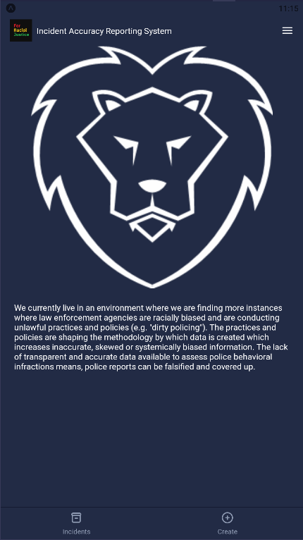
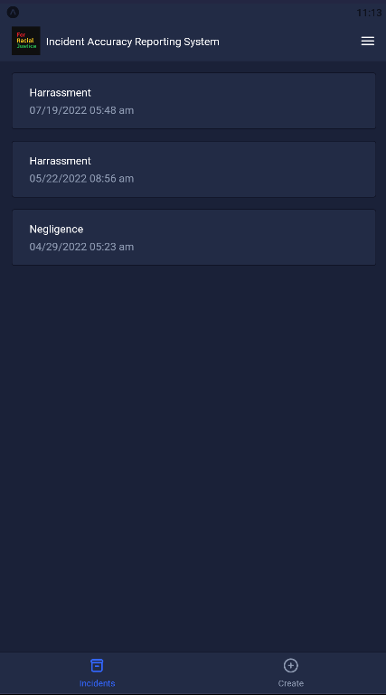
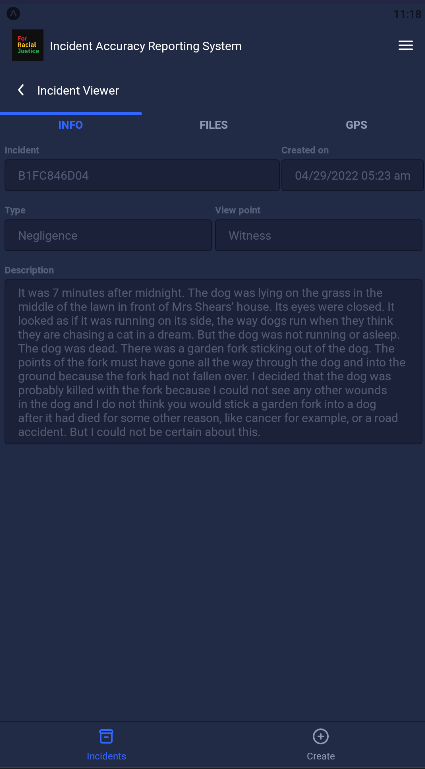
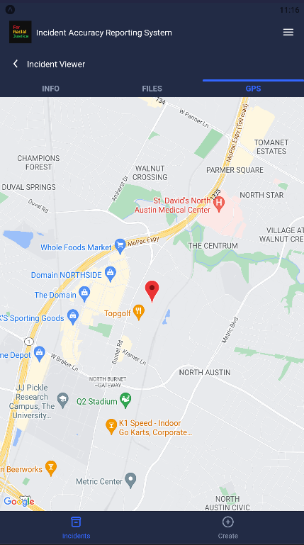
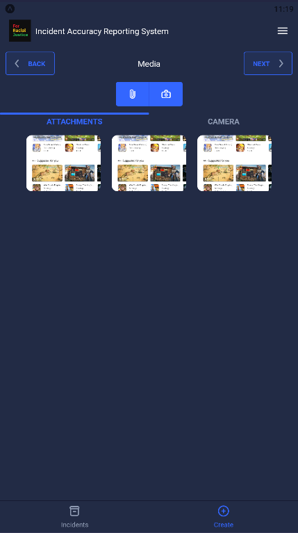
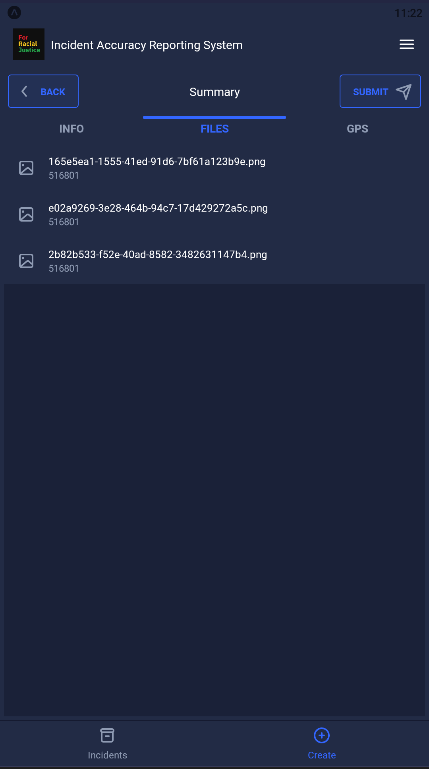

# Mobile application
This is the public component of the project allowing community members to submit incidents.

## Demo the app
To demo the app on your phone by scanning the QR code below.<br />

> If this does not work, get the latest QR code from this [site]().

## Build the app
> Requirements:  Expo, Expo Go, Git, NodeJS
1. Follow these [instructions](https://docs.expo.dev/get-started/installation/) below to install **Expo** on your workstation.
2. Install [Expo Go](https://expo.dev/client) on your mobile device.
   > To view the app on your computer, install an emulator like [BlueStacks](https://www.bluestacks.com/download.html).
3. Install **NodeJS** (v16 LTS used at the time of writing).
4. Clone the repo.
5. Switch to the directory `mobile-app`.
6. Run `npm install` then `npm start`.

## Using Docker
> Requirements: Docker, Expo Go
1. Download and install [Docker Desktop](https://docs.docker.com/get-docker/).
2. Clone the repo.
3. Change directory to `{repo-name}/mobile-app`.
3. Run the following commands to build and run in a container:
   ```
   docker build -t iars-mobile-app .
   docker run -it --rm --name=iars-mobile-app -p 19000:19000 iars-mobile-app
   ```

## Screenshots





